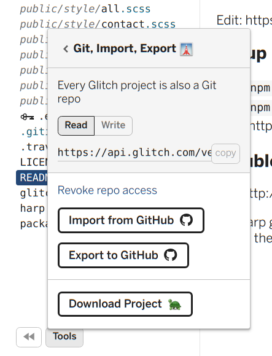
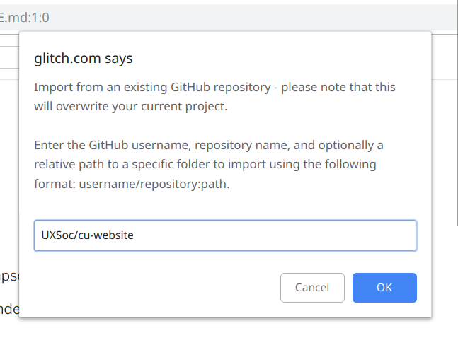

# cu-website

See live: https://agitated-thompson-23da93.netlify.com/

Main Glitch app: https://glitch.com/edit/#!/incandescent-shield

<!-- Remix Button -->
 ⇦ Click to start editing in browser

## Setup

1. `npm i`
1. `npm run start` -> visit URL in browser, which should be http://localhost:9000/.

# Update Glitch

If you've made a remix on Glich, follow these steps to update to the current version:
    
- Select 'Tools' in the lower right. 
- Select 'Git, Import, and Export'. 
- 'Grant access' to GitHub if needed, and select 'Import from GitHub'.

- Put "UXSoc/cu-website" in the field that pops-up, and hit 'OK'.

## TroubleShooting

See http://harpjs.com/ for API.

Is a harp giving a 404 or another issue? Try the command `npm run build` and check the build
folder to see problems.  
